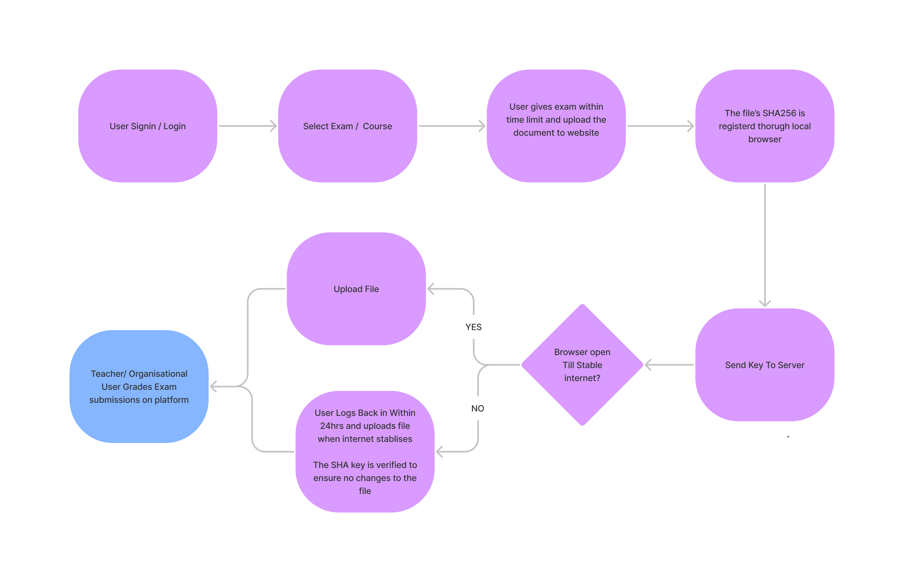
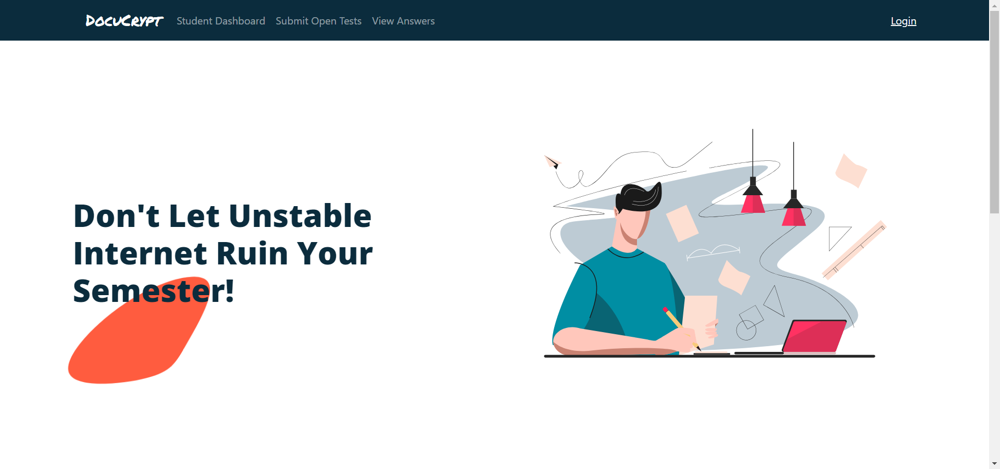
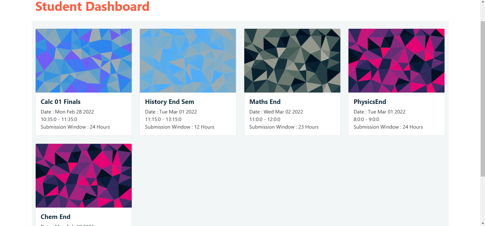
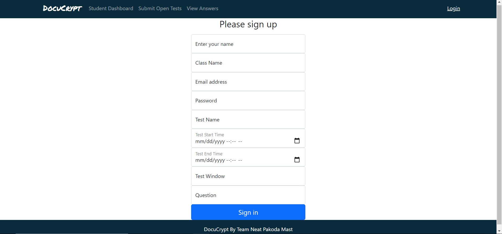
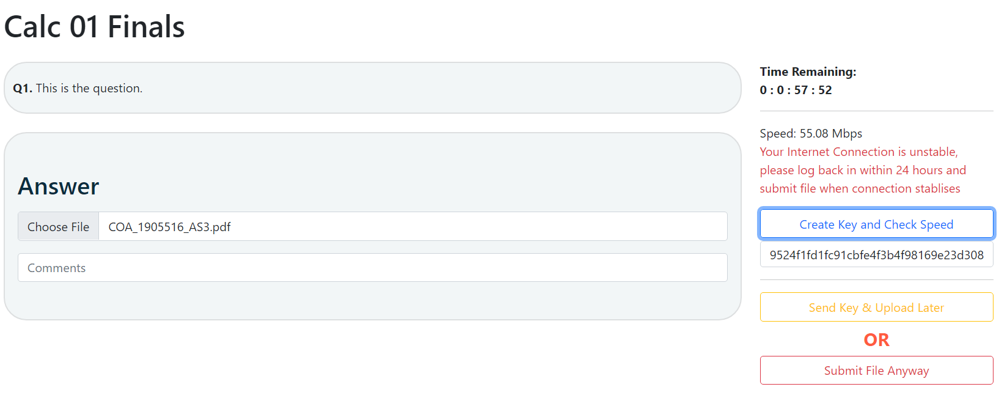
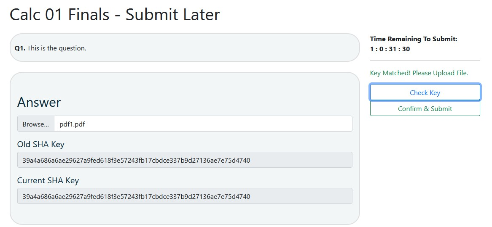

# What Problem statement your hack solves?

Ed-Tech

---
# Describe in detail about your problem

The crunch of submitting answers on time mixed with the uncertainty of and unstable internet connection makes online exam all the more challenging and stressful. After having my CGPA take a hit from not being able to upload one of my answers on time by no fault of my own, an opportunity arose. There was a problem and no clear solution.

---
# What is the proposed solution?

DocuCrypt aims to eliminate this chance of losing out on grades because of bad internet. DocuCrypt creates a SHA-256 signature of a file uploaded on the client’s browser. Once the SHA signature is created, even the smallest changes to the file will change the signature. The signature is a string which is way smaller in size than a file so it will take less time / bandwidth to send it to the server. Once the internet connection stabilizes, a student can upload the file during the submission window specified by the test organizer.

---
# Built With :

- NodeJs
- Express
- MongoDb Atlas
- Cloudinary
- HTML / CSS
- EJS

---
# Demo

<a href="https://youtu.be/ORkrx-agVhw"><h4 style="text-align:center;color:blue;">Demo Video</h4></a>

# Screenshots

